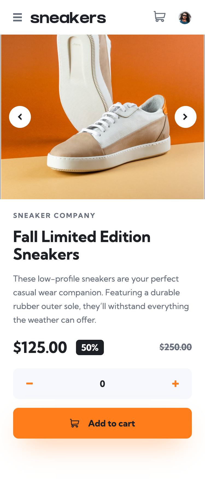
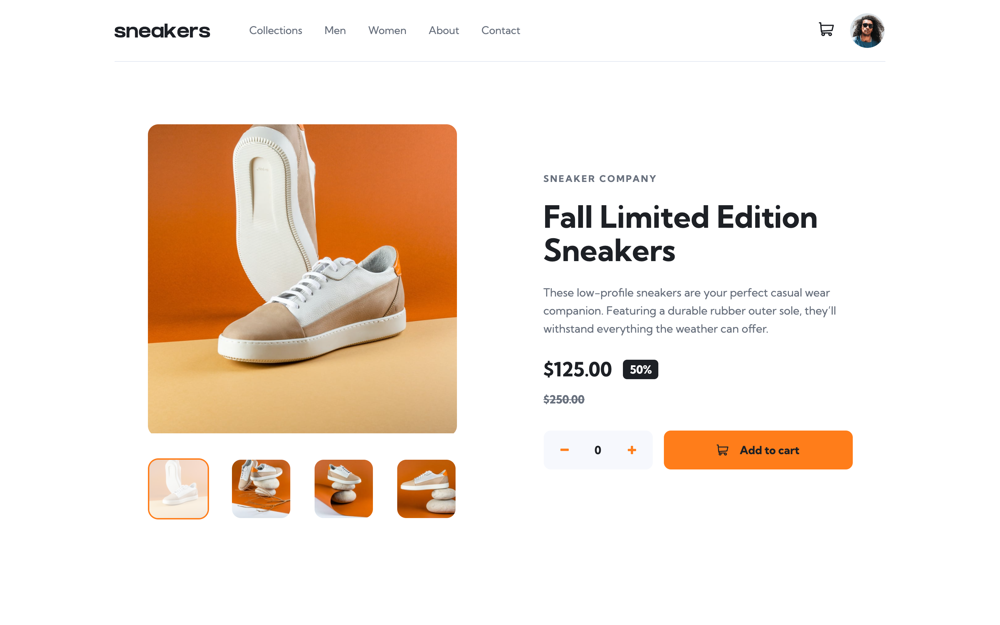
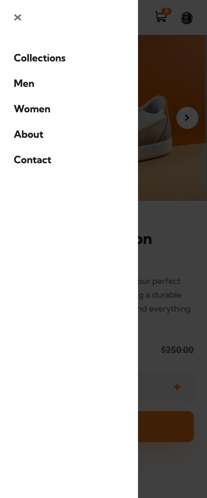
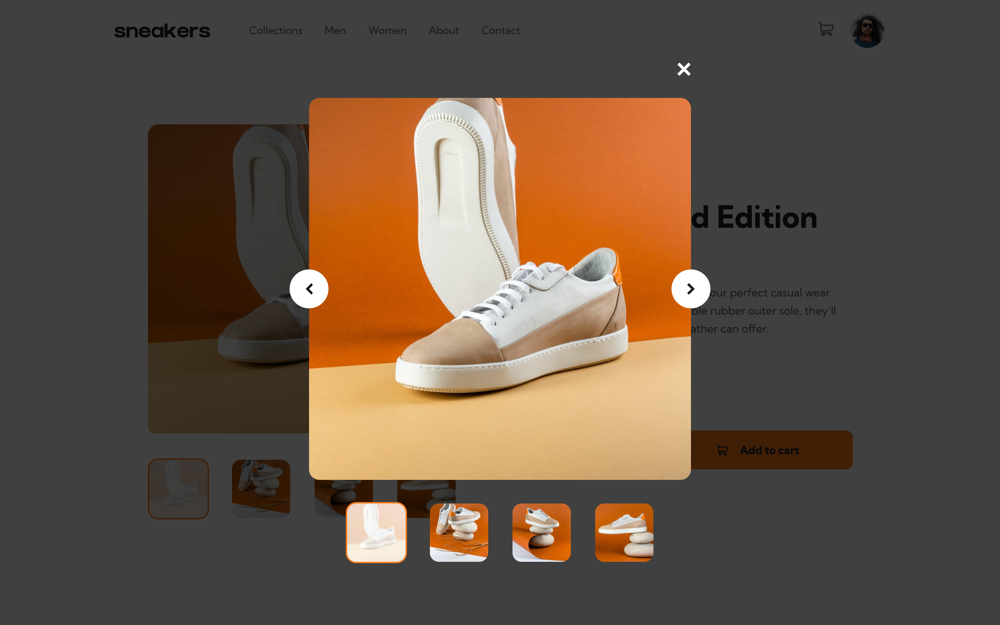
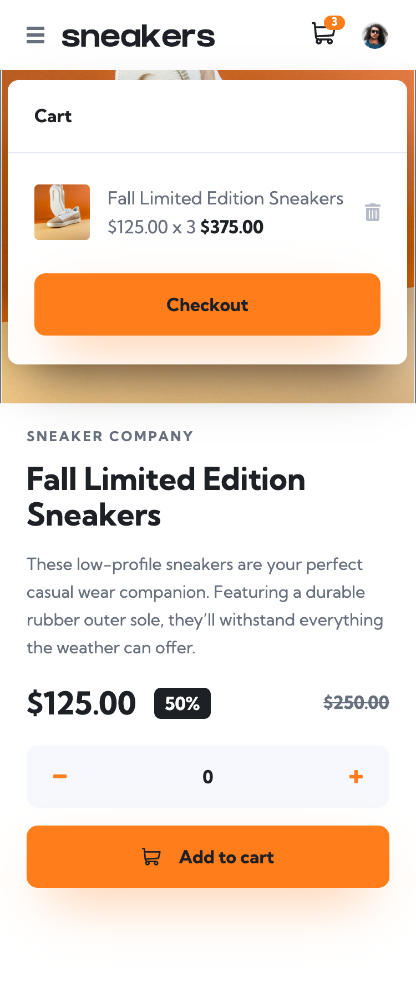
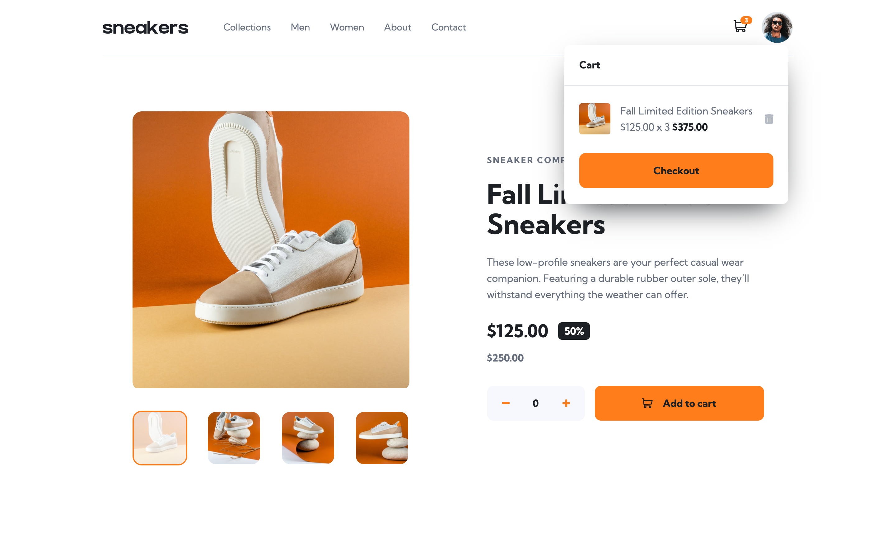

# Frontend Mentor - E-commerce product page solution

This is a solution to the [E-commerce product page challenge on Frontend Mentor](https://www.frontendmentor.io/challenges/ecommerce-product-page-UPsZ9MJp6). Frontend Mentor challenges help you improve your coding skills by building realistic projects.

## Table of contents

- [Overview](#overview)
  - [The challenge](#the-challenge)
  - [Screenshots](#screenshots)
  - [Links](#links)
- [My process](#my-process)
  - [Built with](#built-with)
  - [What I learned](#what-i-learned)
  - [Continued development](#continued-development)
  - [Useful resources](#useful-resources)
- [Author](#author)

## Overview

### The challenge

Users should be able to:

- View the optimal layout for the site depending on their device's screen size
- See hover states for all interactive elements on the page
- Open a lightbox gallery by clicking on the large product image
- Switch the large product image by clicking on the small thumbnail images
- Add items to the cart
- View the cart and remove items from it

### Screenshots

|           Mobile designed at 375px:           |            Desktop designed at 1440px:             |
| :-------------------------------------------: | :------------------------------------------------: |
|       |           |
|                 Mobile (nav):                 |                Desktop (lightbox):                 |
|   |  |
|                Mobile (cart):                 |                  Desktop (cart):                   |
|  |      |

### Links

- Solution URL: [https://github.com/elisilk/ecommerce-product-page](https://github.com/elisilk/ecommerce-product-page)
- Live Site URL: [https://elisilk.github.io/ecommerce-product-page/](https://elisilk.github.io/ecommerce-product-page/)

## My process

### Built with

- Semantic HTML5 markup
- CSS custom properties
- Flexbox
- CSS Grid
- Mobile-first workflow
- Fluid typography
- Accessibility

### What I learned

Hmm 🤔 ...

More Fundamental Practices:

- [Using nesting selectors](https://developer.mozilla.org/en-US/docs/Web/CSS/Nesting_selector)
- [Use min-height: 100dvh](https://ardislu.dev/min-height-100dvh) - I have been moving more and more toward specifying my CSS attributes using [logical properties](https://developer.mozilla.org/en-US/docs/Web/CSS/CSS_logical_properties_and_values). But this slight change to my base `body` styles combines a little but of that thinking, while also taking into account [a known issue](https://stackoverflow.com/questions/74144034/why-is-the-css-height100vh-rule-exceeding-the-viewport-height-on-mobile-device) with how the viewport sizing is calculated on mobile devices that are influenced by the presence or absence of dynamic toolbars ([see this super clear web.dev article with great visuals](https://web.dev/blog/viewport-units)) So now, instead of using `min-height: 100vb`, I will now be using `min-block-size: 100dvb` on my `body` to make sure it takes up the full viewport.
- [`:focus-visible` vs `:focus`](https://developer.mozilla.org/en-US/docs/Web/CSS/:focus-visible) - I was always a little confused on which of the link pseudo-classes to use, and which to avoid (for accessibility reasons). I'm still not 100%, but am thinking more about using `:focus-visible` rather than `:focus`. As explained in the MDN docs some examples of the difference are: "For instance, when a button is clicked using a pointing device, the focus is generally not visually indicated, but when a text box needing user input has focus, focus is indicated." And so the `:focus-visible` pseudo class seems to match on a subset of the times and so over-styling can be avoided in some cases (i.e., no need to style a link or button as focused if a user knows they are pointing to it). That seems like a win to me.
  - [Link Pseudo-Classes (In Order)](https://css-tricks.com/snippets/css/link-pseudo-classes-in-order/)
  - [When is :focus-visible visible?](https://bitsofco.de/when-is-focus-visible-visible/)
  - [When do the :hover, :focus, and :active pseudo-classes apply?](https://bitsofco.de/when-do-the-hover-focus-and-active-pseudo-classes-apply/)
  - [:focus vs :focus-visible](https://developer.mozilla.org/en-US/docs/Web/CSS/:focus-visible#focus_vs_focus-visible)
- Using

More Fine-Grained Ideas:

- [Stacking contexts](https://developer.mozilla.org/en-US/docs/Web/CSS/CSS_positioned_layout/Understanding_z-index/Stacking_context) - There was so much in this challenge that I had to think through with stacking contexts. It feels like the entire challenge had so many layers.
  - [9.9.1 Specifying the stack level: the `z-index` property](https://www.w3.org/TR/CSS21/visuren.html#layers) - For the mobile navigation popup menu, I had to think about stacking contexts a lot. Given the order in which each layer of a given stacking context is painted, I had to adjust where the background color of the mobile nav was set so that the underlying shadow layer didn't get painted above the white background color of the navigation itself.
  - [Solve your z-index issues | z-index and stacking context explained](https://youtu.be/uS8l4YRXbaw?si=2y0q4iikAtNckzof) - YouTube explainer video from Kevin Powell, with two examples, the first CodePen being [a more abstract demonstration of the basic ideas](https://codepen.io/kevinpowell/pen/GdRYLg) and the second CodePen [being a more realistic example](https://codepen.io/kevinpowell/pen/bjEKeq) that I found super helpful.
  - [Understanding & Debugging Stacking Contexts (and the Z-Index)](https://www.lullabot.com/articles/understanding-debugging-stacking-contexts) - I felt like I needed help (or tools) to debug my stacking context issues. This [CSS Stacking Context inspector](https://chromewebstore.google.com/detail/css-stacking-context-insp/apjeljpachdcjkgnamgppgfkmddadcki) Chrome DevTools extension was a decent option. I didn't find that it worked that well (it threw a lot of errors) and wasn't as helpful as I would have hoped. But it did help me think about what were the stacking contexts that I needed to attend to and how to identify the parent that could be key to adjusting the z-index values.
- [pointer-events](https://developer.mozilla.org/en-US/docs/Web/CSS/pointer-events) - The photo carousel has an overlay with the control buttons, but I still wanted the mouse and keyboard events to be able to go through the overlay and be picked up by the photo carousel. And then, the SVG arrow within the control buttons had its own pointer events which I wanted to be handled entirely by the button itself. So using the `pointer-events` attribute was critical.
- [HTML for Subheadings and Headings](https://css-tricks.com/html-for-subheadings-and-headings/) - What is that "subtitle" called? I recall Kevin Powell had another name for it in one of his videos, but I can't remember the exact name at the moment. I think he called it an "eyebrow", and [this site suggests that name plus also "kicker" or "overline"](https://english.stackexchange.com/questions/353869/is-there-an-official-name-for-a-heading-prefix-or-qualifier).
- [This new CSS property just solved animating to height auto](https://youtu.be/JN-nme9oF10?si=h6IKX-WTbZfOnXJP) - Although I didn't use this idea directly, I am working up to learning more about animations, so this was relevant for that. But I also like the [associated example CodePen](https://codepen.io/kevinpowell/pen/XWvpjLr), because it has a barebones implementation of a popup navigation menu, so it's nice to see what Kevin Powell thinks are the critical elements of that kind of component and how he implemented them.
- [Carousels]() - I found some really great CSS-only (or mostly CSS) carousels that I did implement and found to be really cool. But ultimately, I felt limited by those options and ...

### Continued development

Specific areas that the solution should be improved (known issues):

- Implement a "skip to main content" link
- Consider using `<input type="text" inputmode="numeric">` instead of `<input type="number">` as an [alternative number input ](https://developer.mozilla.org/en-US/docs/Web/HTML/Element/input/number#using_number_inputs)
- Implement container queries that determine when to break the quantity input and the add to cart onto separate rows (will help with the next one in terms of maintaining adequate space in the input number field)
- Lighthouse errors
  - Increase the [touch target size](https://dequeuniversity.com/rules/axe/4.10/target-size) and spacing for the increase and decrease quantity buttons
- Two errors in the HTML report
  - (info) The "dialog" element is not supported in all browsers. Please be sure to test, and consider using a polyfill. `<dialog class="lightbox">`
  - (error) Bad value "dialog" for attribute "method" on element "form". `<form method="dialog">`
- Inside the number input field, hitting the return key should submit the form (add item to the cart), right? But now, it seems to just lower the input value by 1. Not sure why.
- Show a "Thank you for shopping with us." message after checking out with the cart.

More general ideas I want to consider:

Hmm 🤔 ...

### Useful resources

- [Accessibility Developer Guide](https://www.accessibility-developer-guide.com/)
- [MDN Web Docs for CSS](https://developer.mozilla.org/en-US/docs/Web/CSS) - Went here a lot to reference the different CSS properties and the shorthands, and all the great explanations about best practices.
- [MDN Guides](https://developer.mozilla.org/en-US/docs/Learn)
- [The Clamp Calculator](https://royalfig.github.io/fluid-typography-calculator/) - Used for all of fluid typography and fluid spacing calculations.
- [The Modern JavaScript Tutorial](https://javascript.info/) -

## Author

- Website - [Eli Silk](https://github.com/elisilk)
- Frontend Mentor - [@elisilk](https://www.frontendmentor.io/profile/elisilk)
